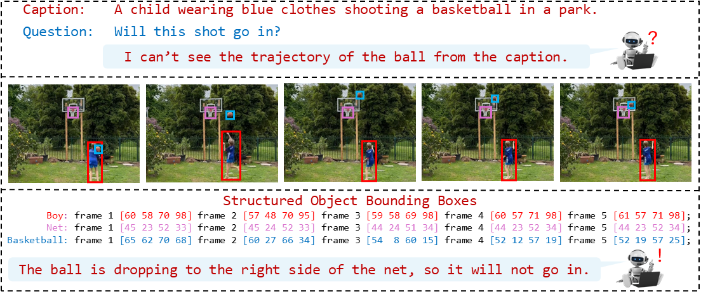

<h1 align="center">

[ICCV 2025](https://iccv.thecvf.com/Conferences/2025)

How Can Objects Help Video-Language Understanding?
</h1>

<h4 align="center">

[Zitian Tang](https://zitiantang.github.io/), [Shijie Wang](https://wang-sj16.github.io/), [Junho Cho](), [Jaewook Yoo](), [Chen Sun](https://chensun.me/index.html)

[]()
[](https://arxiv.org/abs/2504.07454)
[](https://github.com/brown-palm/ObjectMLLM/blob/main/LICENSE)
<br>

</h4>


This repository is the official implementation for the paper [How Can Objects Help Video-Language Understanding?](https://arxiv.org/abs/2504.07454). We propose **ObjectMLLM**, a Multimodal Large Language Model with enhanced spatial understanding capability in videos. ObjectMLLM incorporates visual embedding, video frame caption, and object bounding boxes as inputs. We explore two approaches to adapt bounding boxes to MLLMs - textual representation and embedding projector.



## ⚙️ Install
### Create an Environment
```
git clone git@github.com:brown-palm/ObjectMLLM.git
cd ObjectMLLM
conda create -n objectmllm python=3.10
conda activate objectmllm

# You may want to change the PyTorch CUDA version in requirements.txt
pip install -r requirements.txt
```

### Install Flash Attention

This is only used for ObjectMLLM with VideoLLaMA2 backbone.

To install `flash-attn`, run
```
pip install flash-attn==2.5.9 --no-build-isolation
```

If you find it very slow, an alternative way is to install pre-built `flash-attn` wheels. We recommend you to install a wheel version compatible with your machine from [flash-attention-prebuild-wheels](https://github.com/mjun0812/flash-attention-prebuild-wheels). For example,
```
pip install https://github.com/mjun0812/flash-attention-prebuild-wheels/releases/download/v0.0.8/flash_attn-2.5.9+cu118torch2.4-cp310-cp310-linux_x86_64.whl
```


## 🦙 ObjectMLLM with LLaMA3 Backbone

### Data Preparation

You can use our [preprocessed datasets](https://drive.google.com/file/d/10OBYMpsONUjd9GZ_0K7TgY3jBN6cBNs6/view?usp=drive_link). For convenience, you can directly run our download script.
```
cd llama3
bash scripts/download/download_dataset.sh
```
This will download the datasets via `gdown` and unzip them to `llama3/data`.

If you want to run our experiments about embedding projector, you will need the raw files of our detected & tracked object bounding boxes ([CLEVRER-MC](https://drive.google.com/file/d/1xqBAhHXmpqZSPOxzMJOsQO5wEyRXxqA5/view?usp=drive_link), [Perception Test](https://drive.google.com/file/d/1wrjq0nPSvGABgrVoMJk-4DJ0rMwOMutl/view?usp=drive_link), [STAR](https://drive.google.com/file/d/1TlHffKte_XmgdUQUCRx4uX0AKy33kI_o/view?usp=drive_link), [NExT-QA & IntentQA](https://drive.google.com/file/d/1KiYfx3tS0mMdezAgBJ_p9ekm7eIqJz_U/view?usp=drive_link)). For convenience, you can use our download script.
```
cd llama3
bash scripts/download/download_bbox.sh
```
This will download the bounding boxes and unzip them to `llama3/data/{dataset_name}/bbox`.

### Base Model Preparation

Please download the LLaMA3-8B base model from [huggingface](https://huggingface.co/meta-llama/Meta-Llama-3-8B). Especially, we will need the `original/` checkpoint in our implementation. You can store the base model anywhere on your device and set its path as `model_path` in our training and evaluation scripts.

### Training

To train ObjectMLLM with textual bounding box representation, we provide training scripts in [`llama3/scripts/train_textual`](llama3/scripts/train_textual). You can run them inside the `llama3` folder. For example, to train a model with all three modalities as input on Perception Test, run
```
cd llama3
bash scripts/train_textual/ptest_vis_cap_box.sh
```

To train ObjectMLLM with bounding box projector, the scripts are in [`llama3/scripts/train_projector`](llama3/scripts/train_projector). For example,
```
cd llama3
bash scripts/train_projector/ptest_box_projector.sh
```

In each script, `--max_seq_len` specifies the maximal context window length that is required for the model. Training tasks with context window lengths smaller than 1500 are executable on GPUs with 40G memory (e.g, A6000). For tasks with context length larger than 1500, GPUs with 80G memory (e.g, A100 and H100) are required. According to the number of your available GPUs, you may need to adjust `--nproc_per_node` and `--accum_iter` accordingly.

### Released Checkpoints

We release our [LLaMA3 checkpoints](https://drive.google.com/file/d/1ZUt2f_iYFL-nCLXwWqvYnJS9p7to1Md0/view?usp=drive_link) trained on each dataset. You can use our script to download them.
```
cd llama3
bash scripts/download/download_checkpoint.sh
```
This will download and unzip the checkpoints to `llama3/checkpoint_released`.

### Evaluation

Our evaluation scripts are in [`llama3/scripts/eval`](llama3/scripts/eval). They are executable on a single 40G GPU (e.g. A6000). You may enlarge `--nproc_per_node` to use multiple GPUs to speed up. 

To evaluate our released checkpoints, please set `CHECKPOINT_DIR=checkpoint_released`. To evaluate checkpoints reproduced by our training scripts, set `CHECKPOINT_DIR=checkpoint`.

## 🤖 ObjectMLLM with VideoLLaMA2 Backbone

### Data Preparation

You can use our [preprocessed datasets](https://drive.google.com/file/d/1TLY0Qa0c7lFWokinBFgGX5qdIeajQ0_t/view?usp=drive_link). For convenience, you can directly run our download script.
```
cd videollama2
bash scripts/download/download_dataset.sh
```
This will download the datasets via `gdown` and unzip them to `videollama2/data`.

To develop or evaluate ObjectMLLM with VideoLLaMA2 backbone, you will also need the raw **videos** from the [CLEVRER](http://clevrer.csail.mit.edu/#), [Perception Test](https://github.com/google-deepmind/perception_test), [STAR](https://bobbywu.com/STAR/), and [NExT-QA](https://github.com/doc-doc/NExT-QA) datasets. Please download them as needed. Note that IntentQA shares the same video source as NExT-QA.

### Training

To train ObjectMLLM with VideoLLaMA2 backbone, we provide training scripts in [`videollama2/scripts/train`](videollama2/scripts/train). You can run them inside the `videollama2` folder. For example, to train a model on Perception Test, run
```
cd videollama2
bash scripts/train/ptest_vis_box.sh
```

In each script, you need to set `YOUR_VIDEO_DIR` to the path of your downloaded dataset videos. All the experiments are runnable on GPUs with 40G memory. You may adjust `ARG_NPROC_PER_NODE` according to your number of GPUs.

### Released Checkpoints

We release our VideoLLaMA2 checkpoints trained on [CLEVRER-MC](https://drive.google.com/file/d/1wop4SBf9iicx7I4nEsvoGtyiPQCaE8iK/view?usp=drive_link), [Perception Test](https://drive.google.com/file/d/1hDh75PhEv33k1BepLsGMQJpxU1IJco9d/view?usp=drive_link), [STAR](https://drive.google.com/file/d/1lhY-WKSlH_gj2wzrMitC2Uc3o6Ih2sCF/view?usp=drive_link), [NExT-QA](https://drive.google.com/file/d/1XxJ8cCB1c3O4r0sILIMyUPyDFbwpo4J1/view?usp=drive_link), and [IntentQA](https://drive.google.com/file/d/1pIZSf68bILH3Tv_VDCZ9PPOzbSHhJ15A/view?usp=drive_link). You can use our script to download them.
```
cd videollama2
bash scripts/download/download_checkpoint.sh
```
This will download and unzip the checkpoints to `videollama2/checkpoint_released`.

### Evaluation

Our evaluation scripts are in [`videollama2/scripts/eval`](videollama2/scripts/eval). They are executable on a single 24G GPU (e.g., GeForce 3090).

To evaluate our released checkpoints, please set `CHECKPOINT_DIR=checkpoint_released`. To evaluate checkpoints reproduced by our training scripts, set `CHECKPOINT_DIR=checkpoint`.


## 👍 Acknowledgements

This repo is built upon [Vamos](https://github.com/brown-palm/Vamos) and [VideoLLaMA2](https://github.com/DAMO-NLP-SG/VideoLLaMA2).

## 📑 Citation
```
@misc{tang2025objectmllm,
    title={How Can Objects Help Video-Language Understanding?}, 
    author={Zitian Tang and Shijie Wang and Junho Cho and Jaewook Yoo and Chen Sun},
    year={2025},
    eprint={2504.07454},
    archivePrefix={arXiv},
    primaryClass={cs.CV}
}
```

## 🔒 LICENSE
ObjectMLLM is released under [MIT License](LICENSE).